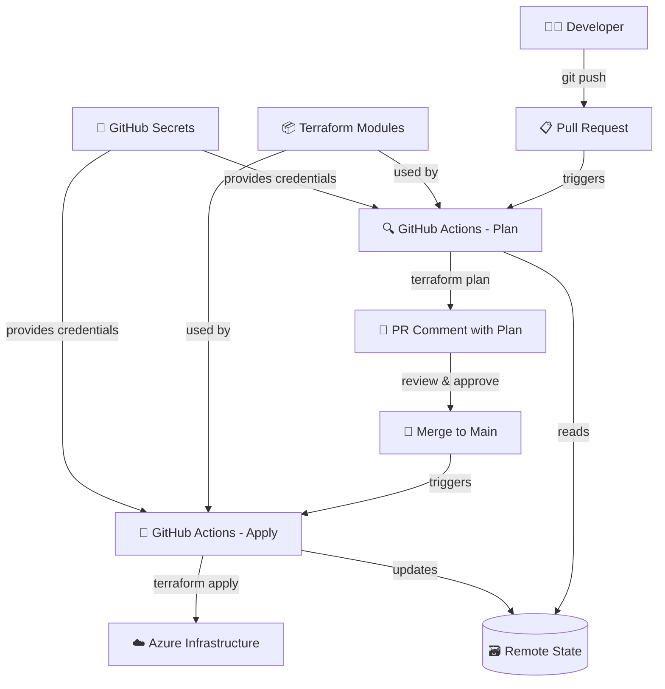

# Azure Terraform Foundation

[](https://www.terraform.io/)
[](https://azure.microsoft.com/)
[](https://github.com/features/actions)
[](LICENSE)

A production-ready Terraform foundation for Azure infrastructure with automated CI/CD pipelines, modular architecture, and enterprise-grade security practices.

## 🎯 Key Features

- **Automated CI/CD** - GitHub Actions pipeline with plan/apply workflows
- **Modular Architecture** - Reusable Terraform modules for scalable infrastructure
- **Enterprise Security** - Remote state, access control, and secret management
- **Multi-Environment** - Separate dev/prod configurations with environment protection
- **Plan Visibility** - Automatic PR comments with Terraform plan output
- **Resource Protection** - Configurable resource locks for production environments

## 🌟 What This Repo Demonstrates

### Infrastructure as Code (IaC)
- ✅ Terraform modules and environments
- ✅ Azure resource provisioning
- ✅ Infrastructure versioning and state management
- ✅ Remote backend with state locking

### DevOps & CI/CD
- ✅ Automated deployment pipeline
- ✅ PR validation with Terraform plan preview
- ✅ Environment-based deployment strategies
- ✅ GitHub Actions workflows

### Development Best Practices
- ✅ Modular architecture for reusability
- ✅ DRY principles and code organization
- ✅ Environment isolation
- ✅ Configuration management

### Cloud & Security
- ✅ Azure resource management
- ✅ Service principal authentication
- ✅ Secret management via GitHub Secrets
- ✅ Resource tagging and governance

## ️ Tech Stack

### Infrastructure
- **Terraform** - Infrastructure as Code
- **Azure** - Cloud platform (Resource Groups, Storage, etc.)
- **HCL** - HashiCorp Configuration Language

### CI/CD & Automation
- **GitHub Actions** - Automated workflows
- **Azure CLI** - Command-line tools
- **Bash** - Shell scripting

## 🏗️ Architecture Overview

This repository demonstrates enterprise-grade Infrastructure as Code (IaC) workflow:



**Core Technologies & Benefits:**
- **Terraform** → Infrastructure as Code with remote state management
- **GitHub Actions** → Automated CI/CD with plan validation and approval workflows  
- **Azure** → Enterprise cloud platform with robust security and compliance
- **Modular Design** → Reusable components promoting DRY principles and consistency
- **Security First** → Secret management, least privilege access, and environment isolation

## 📁 Repository Structure

```
azure-terraform-foundation/
├── .github/workflows/     # CI/CD pipeline definitions
├── backend-configs/       # Terraform backend configurations
├── environments/          # Environment-specific configs (dev, prod)
├── modules/               # Reusable Terraform modules
│   └── resource-group/    # Resource group module
└── docs/                  # Documentation
```

See [Repository Structure](docs/repository-structure.md) for detailed breakdown.

**Module Benefits:**
- **Self-contained** - All infrastructure code in organized modules
- **Testable** - Clear boundaries and interfaces
- **Reusable** - DRY principles across environments
- **Scalable** - Easy to extend with new modules

## 🚀 CI/CD Pipeline

Automated deployment pipeline with comprehensive validation.

```
Pull Request → Terraform Plan → Review → Merge → Terraform Apply → Azure Infrastructure
```

**Key Features:**
- ✅ Zero-downtime deployment strategy
- ✅ Automated plan validation on PRs
- ✅ Plan output posted as PR comments
- ✅ Environment-specific workflows
- ✅ Secure credential management

**Triggers:**
- Push to `main` with changes to `environments/**` or workflows
- Pull requests for validation (no deployment)

See [CI/CD Pipeline Documentation](docs/cicd-pipeline.md) for complete details.

## 💻 Quick Start

### Run Locally

```bash
# Clone the repository
git clone https://github.com/gilbertrios/azure-terraform-foundation.git
cd azure-terraform-foundation

# Authenticate with Azure
az login
az account set --subscription "your-subscription-id"

# Navigate to environment
cd environments/dev

# Initialize Terraform
terraform init -backend-config=../../backend-configs/dev.hcl

# Run the infrastructure
terraform plan
terraform apply
```

The infrastructure will be provisioned in your Azure subscription!

**Optional:** See [Configuration Guide](docs/configuration.md) for backend setup and environment variables.

### Deploy to Azure

```bash
# 1. Configure Azure credentials (see docs/setup-guide.md)
# 2. Push to main branch
git push origin main

# The pipeline will:
# ✅ Validate configuration
# ✅ Provision infrastructure (Terraform)
# ✅ Update remote state
```

## 📦 Modules

### Resource Group Module

Creates an Azure Resource Group with standardized configuration.

**Usage:**
```hcl
module "resource_group" {
  source = "../../modules/resource-group"
  
  name         = "rg-myapp-dev"
  location     = "East US"
  environment  = "dev"
  project_name = "azure-terraform-foundation"
  
  additional_tags = {
    Owner      = "DevTeam"
    CostCenter = "Engineering"
  }
  
  enable_lock = false
}
```

**Features:**
- Standardized tagging
- Optional resource locking
- Input validation
- Consistent naming conventions

## 📚 Documentation

### Getting Started
- [Setup Guide](docs/setup-guide.md) - Deploy to Azure step-by-step
- [Configuration Guide](docs/configuration.md) - Backend setup and environment variables
- [Commands Reference](docs/commands-reference.md) - Common Terraform and Azure CLI commands

### Architecture & Design
- [Repository Structure](docs/repository-structure.md) - Folder organization and design principles
- [CI/CD Pipeline](docs/cicd-pipeline.md) - Deployment pipeline and workflows

## 🔄 Roadmap

### Coming Soon
- [ ] **Additional Azure Modules** - Virtual Networks, Key Vault, Application Gateway
- [ ] **Terraform Testing** - Integration with Terratest for automated validation
- [ ] **Cost Monitoring** - Azure Cost Management integration and alerts
- [ ] **Multi-Region Support** - Cross-region deployment patterns
- [ ] **Security Scanning** - Checkov/TFSec integration for security compliance

### Ideas & Contributions Welcome
- [ ] **Kubernetes Integration** - AKS cluster provisioning modules
- [ ] **Monitoring Stack** - Application Insights and Log Analytics setup
- [ ] **Backup Strategies** - Automated backup policies for resources
- [ ] **Disaster Recovery** - Cross-region failover patterns

*Want to contribute? Open an issue to discuss new features!*

## 📄 License

This project is licensed under the MIT License - see the [LICENSE](LICENSE) file for details.

## 🤝 Contributing

Contributions are welcome! Please feel free to submit a Pull Request.

1. Fork the repository
2. Create your feature branch (`git checkout -b feature/amazing-feature`)
3. Commit your changes (`git commit -m 'Add some amazing feature'`)
4. Push to the branch (`git push origin feature/amazing-feature`)
5. Open a Pull Request

## 📞 Support & Connect

### 🌐 Connect With Me
Interested in Infrastructure as Code, Azure, or DevOps? Let's connect!

- 💼 **LinkedIn**: [Connect with me](https://linkedin.com/in/gilbert-rios-22586918)
- 📧 **Email**: gilbertrios@hotmail.com
- 💡 **GitHub**: [@gilbertrios](https://github.com/gilbertrios)

---

⭐ **Star this repo** if you find it useful for learning or reference!

