# Azure Terraform Foundation

> **A production-ready Terraform foundation for Azure infrastructure with automated CI/CD pipelines, modular design, and enterprise-grade security practices.**

*Demonstrating Infrastructure as Code excellence through real-world patterns and best practices*


[](https://www.terraform.io/)
[](https://azure.microsoft.com/)
[](https://github.com/features/actions)
[](https://opensource.org/licenses/MIT)

*A demonstration of Infrastructure as Code best practices*

## ✨ Key Features

- 🔄 **Automated CI/CD**: GitHub Actions pipeline with plan/apply workflows
- 🏗️ **Modular Architecture**: Reusable Terraform modules for scalable infrastructure
- 🔐 **Enterprise Security**: Remote state, access control, and secret management
- 🌍 **Multi-Environment**: Separate dev/prod configurations with environment protection
- 📊 **Plan Visibility**: Automatic PR comments with Terraform plan output
- 🛡️ **Resource Protection**: Configurable resource locks for production environments

## 📊 Project Stats

- **Environments**: 2 (Dev, Prod)
- **Modules**: 1+ (Expandable architecture)
- **CI/CD Pipeline**: Fully automated with GitHub Actions
- **State Management**: Remote backend with Azure Storage
- **Terraform Version**: 1.0+

## 🏗️ Architecture Overview

This repository demonstrates enterprise-grade Infrastructure as Code (IaC) workflow:

```mermaid
graph TD
    A[👨‍💻 Developer] -->|git push| B[📋 Pull Request]
    B -->|triggers| C[🔍 GitHub Actions - Plan]
    C -->|terraform plan| D[💬 PR Comment with Plan]
    D -->|review & approve| E[🔀 Merge to Main]
    E -->|triggers| F[🚀 GitHub Actions - Apply]
    F -->|terraform apply| G[☁️ Azure Infrastructure]
    
    C -->|reads| H[(🗃️ Remote State)]
    F -->|updates| H
    
    I[📦 Terraform Modules] -->|used by| C
    I -->|used by| F
    
    J[🔐 GitHub Secrets] -->|provides credentials| C
    J -->|provides credentials| F
```



**Core Technologies & Benefits:**
- 🏗️ **Terraform** → Infrastructure as Code with remote state management
- 🔄 **GitHub Actions** → Automated CI/CD with plan validation and approval workflows  
- ☁️ **Azure** → Enterprise cloud platform with robust security and compliance
- 📦 **Modular Design** → Reusable components promoting DRY principles and consistency
- 🔐 **Security First** → Secret management, least privilege access, and environment isolation


## 📁 Repository Structure

```
azure-terraform-foundation/
├── .github/workflows/         # CI/CD pipeline definitions
│   └── terraform.yml          # Main Terraform workflow
├── backend-configs/           # Terraform backend configurations
│   ├── dev.hcl                # Development backend config
│   └── prod.hcl               # Production backend config
├── environments/              # Environment-specific configurations
│   ├── dev/                   # Development environment
│   │   ├── main.tf            # Main Terraform configuration
│   │   ├── variables.tf       # Variable definitions
│   │   ├── outputs.tf         # Output definitions
│   │   └── terraform.tfvars   # Variable values
│   └── prod/                  # Production environment
│       ├── main.tf
│       ├── variables.tf
│       ├── outputs.tf
│       └── terraform.tfvars
├── modules/                   # Reusable Terraform modules
│   └── resource-group/        # Resource group module
│       ├── main.tf
│       ├── variables.tf
│       ├── outputs.tf
│       └── README.md
├── .gitignore                # Git ignore rules
├── .terraformignore          # Terraform ignore rules
└── README.md                 # This file
```

## 🚀 Quick Start

### Prerequisites

- [Terraform](https://www.terraform.io/downloads.html) >= 1.0
- [Azure CLI](https://docs.microsoft.com/en-us/cli/azure/install-azure-cli)
- Azure subscription with appropriate permissions

### Local Development Setup

1. **Clone the repository**
   ```bash
   git clone https://github.com/gilbertrios/azure-terraform-foundation.git
   cd azure-terraform-foundation
   ```

2. **Authenticate with Azure**
   ```bash
   az login
   az account set --subscription "your-subscription-id"
   ```

3. **Navigate to an environment**
   ```bash
   cd environments/dev
   ```

4. **Initialize Terraform**
   ```bash
   terraform init -backend-config=../../backend-configs/dev.hcl
   ```

5. **Plan and apply**
   ```bash
   terraform plan
   terraform apply
   ```

## 🔧 Configuration

### Environment Variables

For local development, set these environment variables:
```bash
export ARM_CLIENT_ID="your-client-id"
export ARM_CLIENT_SECRET="your-client-secret"
export ARM_SUBSCRIPTION_ID="your-subscription-id"
export ARM_TENANT_ID="your-tenant-id"
```

### GitHub Secrets

For CI/CD pipeline, configure these repository secrets:
- `ARM_CLIENT_ID`
- `ARM_CLIENT_SECRET` 
- `ARM_SUBSCRIPTION_ID`
- `ARM_TENANT_ID`

## 🤖 CI/CD Pipeline

### Workflow Triggers

The pipeline automatically runs on:
- **Pull Requests** with changes to `environments/**`
- **Push to main** branch with changes to `environments/**`

### Pipeline Stages

1. **Plan Stage** (Pull Requests)
   - Runs `terraform plan` for changed environments
   - Posts plan output as PR comments
   - Validates configuration

2. **Apply Stage** (Main Branch)
   - Runs `terraform apply` for changed environments
   - Uses environment protection rules
   - Updates infrastructure

### Environment Matrix

The pipeline supports multiple environments:
```yaml
strategy:
  matrix:
    environment: [dev, prod]
```

## 📦 Modules

### Resource Group Module

Creates an Azure Resource Group with:
- Standardized tagging
- Optional resource locking
- Input validation
- Consistent naming conventions

**Usage:**
```hcl
module "resource_group" {
  source = "../../modules/resource-group"
  
  name         = "rg-myapp-dev"
  location     = "East US"
  environment  = "dev"
  project_name = "azure-terraform-foundation"
  
  additional_tags = {
    Owner      = "DevTeam"
    CostCenter = "Engineering"
  }
  
  enable_lock = false
}
```

## 🔒 Security

### State Management
- Remote state stored in Azure Storage Account
- State locking enabled via Azure Blob Storage
- Environment-specific state files

### Access Control
- Service Principal authentication for CI/CD
- Least privilege access principles
- Environment-specific credentials

### Secret Management
- Sensitive values stored in GitHub Secrets
- No hardcoded credentials in repository
- `.gitignore` configured for sensitive files

## 🌍 Environments

### Development (dev)
- **Purpose**: Development and testing
- **Resource Naming**: `*-dev`
- **Resource Lock**: Disabled
- **Auto-deployment**: Enabled on main branch

### Production (prod)
- **Purpose**: Production workloads
- **Resource Naming**: `*-prod`
- **Resource Lock**: Enabled
- **Auto-deployment**: Manual approval required

## 📋 Commands Reference

### Local Development
```bash
# Initialize backend
terraform init -backend-config=../../backend-configs/dev.hcl

# Format code
terraform fmt -recursive

# Validate configuration
terraform validate

# Plan changes
terraform plan -out=tfplan

# Apply changes
terraform apply tfplan

# Destroy resources
terraform destroy
```

### GitHub CLI
```bash
# Trigger workflow manually
gh workflow run terraform.yml

# View workflow status
gh run list

# Watch workflow execution
gh run watch
```

## 🤝 Contributing

1. **Create a feature branch**
   ```bash
   git checkout -b feature/new-infrastructure
   ```

2. **Make changes**
   - Update Terraform configuration
   - Follow module conventions
   - Update documentation

3. **Test locally**
   ```bash
   cd environments/dev
   terraform plan
   ```

4. **Create Pull Request**
   - Pipeline will run automatically
   - Review terraform plan output
   - Get approval from team

5. **Merge to main**
   - Infrastructure will be deployed automatically
   - Monitor deployment in GitHub Actions

## 📚 Resources

### Terraform
- [Terraform Documentation](https://www.terraform.io/docs)
- [Azure Provider Documentation](https://registry.terraform.io/providers/hashicorp/azurerm/latest/docs)
- [Terraform Best Practices](https://www.terraform.io/docs/cloud/guides/recommended-practices/index.html)

### Azure
- [Azure Resource Manager Templates](https://docs.microsoft.com/en-us/azure/azure-resource-manager/)
- [Azure CLI Reference](https://docs.microsoft.com/en-us/cli/azure/reference-index)
- [Azure Architecture Center](https://docs.microsoft.com/en-us/azure/architecture/)

### GitHub Actions
- [GitHub Actions Documentation](https://docs.github.com/en/actions)
- [Terraform GitHub Actions](https://github.com/hashicorp/setup-terraform)

## 📞 Support

For questions or issues:
1. Check existing [Issues](https://github.com/gilbertrios/azure-terraform-foundation/issues)
2. Create a new issue with detailed description
3. Contact the infrastructure team

## 📄 License

This project is licensed under the MIT License - see the LICENSE file for details.
